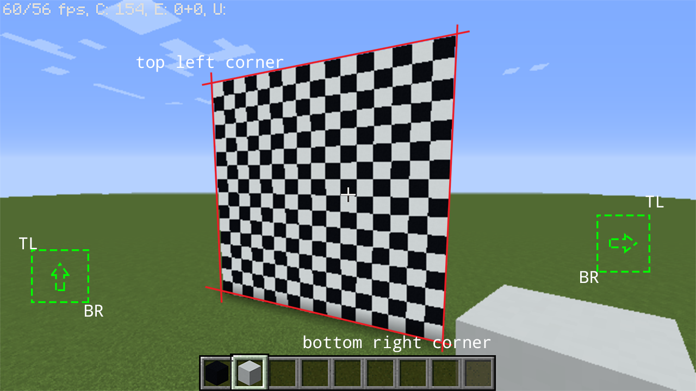
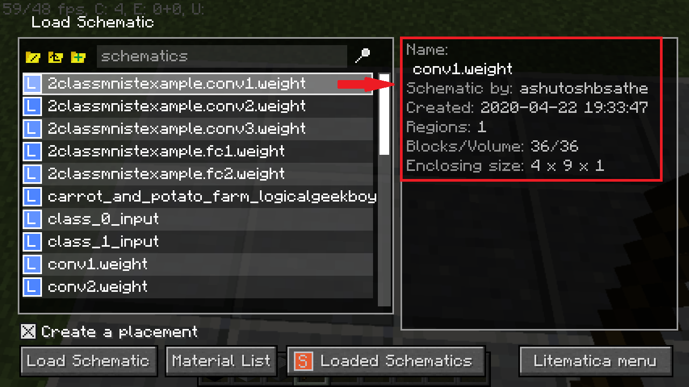
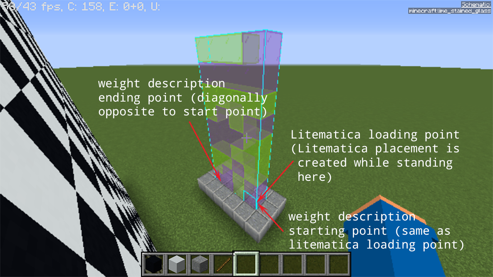
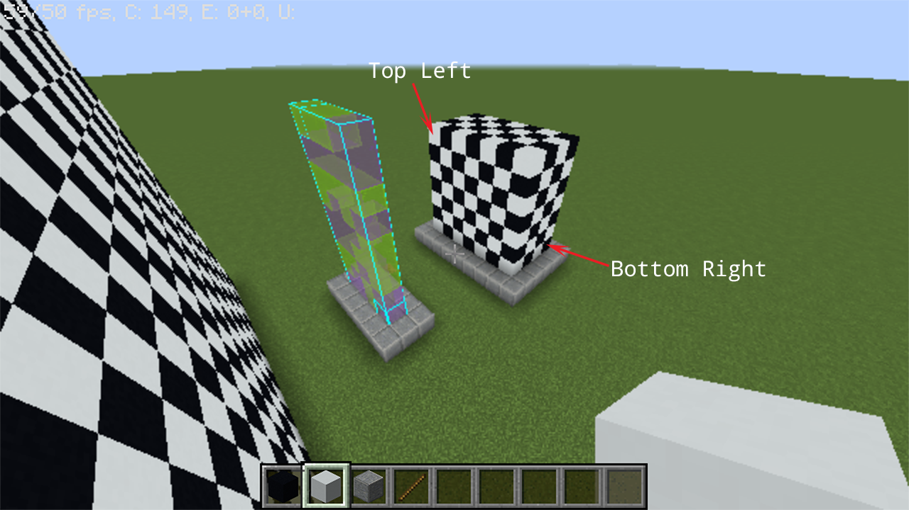

# Quick Start Guide
{: .no_toc }

## Table of contents
{: .no_toc .text-delta }

1. TOC
{:toc}

---


`scarpet-nn` can be theoretically used to build any neural network architecture involving convolution and fully connected layers. _As explained in the introduction, the framework assumes that the weights, activations and inputs to this neural network are binary_ (i.e. they are either +1 or -1 as explained in ["Binarized Neural Networks"](https://arxiv.org/abs/1602.02830) paper). This guide assumes familiarity with [pytorch](https://github.com/pytorch/pytorch), [litematica](https://github.com/maruohon/litematica) and [carpetmod](https://github.com/gnembon/fabric-carpet).

## Install dependencies
Make sure following things are installed:

1. Minecraft Java Edition
2. Mods: [Litematica](https://github.com/maruohon/litematica) and [carpetmod](https://github.com/gnembon/fabric-carpet)
3. Python3 with [pytorch](https://github.com/pytorch/pytorch) and [nbtlib](https://github.com/vberlier/nbtlib)
4. A text editor


## Preparing "binarized" neural network
As a first step, you should train your neural network as explained in [BNN paper](https://arxiv.org/abs/1602.02830). If you are already familiar with training neural networks in pytorch, you can simply use [`binarized_modules.py`](https://github.com/ashutoshbsathe/scarpet-nn/blob/master/nn-training/binarized_modules.py) for implementation of binarized layers. Sample code for training such a neural network is available [here](https://github.com/ashutoshbsathe/scarpet-nn/blob/master/nn-training/).

To get optimal results, use deterministic binarization instead of stochastic binarization. (Sec 1.1 of [paper](https://arxiv.org/abs/1602.02830) explains difference between these 2 methods). An important thing to remember when training such networks is to properly normalize the input to the neural network so that it can be (deterministically) binarized using [`torch.sign()`](https://pytorch.org/docs/stable/torch.html#torch.sign) directly. 

Moreover, at the moment, the framework does not support `bias` parameters in layers of neural network. So please pass `bias=False` when building your neural network.

At the end of this step, you should have model weights saved in a file.

## Converting neural network into litematica schematics
[Litematica](https://github.com/maruohon/litematica) is a client-side Minecraft mod that allows creating schematics of Minecraft builds. We use litematica to generate schematics of our neural network weights. These schematics can be referred in game for placing blocks. 

Run [`modeltolitematica.py`](https://github.com/ashutoshbsathe/scarpet-nn/blob/master/nn-to-litematica/modeltolitematica.py) for converting all layers of your neural network into different litematica schematics. Each schematic contains only 1 layer of the neural network. You can configure what block represents +1 (by default 'minecraft:purple_stained_glass') and what block represents -1 (by default 'minecraft:lime_stained_glass').

At the end of this step, you should have a set of litematica schematics (`.litematic` files) ready with you. Make sure that all of the layers in neural network have a corresponding `.litematic` file. If you are using the same neural network from sample code you should have files named `conv1.weight.litematica`, `conv2.weight.litematica`, `conv3.weight.litematica`, `fc1.weight.litematica`, `fc2.weight.litematica`.

## Putting it all together in a Minecraft world
Your neural network will need space for input layer, all the layers and the intermediate activations. So go to sufficiently empty space in your world or simply create a new superflat world for experimenting. Refer to the [world download of demo](https://drive.google.com/open?id=13lw4Ct5H-vgh2ajpMc7Xw2NHdzymXeEa) to know more about aligning layers in Minecraft world.

After the alignment of layers and the activations is complete, you should write a scarpet app corresponding to your neural network architecture and placement. Refer to [`twoclassmnist`](https://github.com/ashutoshbsathe/scarpet-nn/blob/master/scarpet-apps/twoclassmnist.sc) to see how coordinates from Minecraft world are translated into scarpet code. Ideally, you should be writing at least `forward()` function. Your neural network implementation app should import the necessary layers from [`nn`](https://github.com/ashutoshbsathe/scarpet-nn/blob/master/scarpet-apps/nn.sc) app and provide necessary coordinates to it.

Finally, to run your neural network, load your scarpet app containing your neural network implementation (i.e. your `forward()`) and setup a command block to invoke `forward()` function from your app.

# Planning `forward` function
This is a demonstration on how to get started with writing a `forward` function in scarpet. For now, let's assume that our neural network is defined in pytorch as follows:
```python
import torch.nn as nn
import torch.nn.functional as F
from binarized_modules import BinarizeConv2d, BinarizeLinear
class Net(nn.Module):
    def __init__(self):
        super(Net, self).__init__()
        self.conv1 = BinarizeConv2d(1, 4, stride=2, kernel_size=3, bias=False)
        self.conv2 = BinarizeConv2d(4, 8, stride=2, kernel_size=3, bias=False)
        self.conv3 = BinarizeConv2d(8, 16, stride=2, kernel_size=3, bias=False)
        self.fc1 = BinarizeLinear(16, 8, bias=False)
        self.fc2 = BinarizeLinear(8, 1, bias=False)
    def forward(self, x):
        out = F.hardtanh(self.conv1(x))
        out = F.hardtanh(self.conv2(out))
        out = F.hardtanh(self.conv3(out))
        out = out.view(-1, 16)
        out = F.hardtanh(self.fc1(out))
        out = self.fc2(out)
        return out
```
We can see that our model uses 3 conv layers, 1 reshape or `torch.Tensor.view` operation and 2 layers. After generating litematica schematic for each of they layer, open up a new Minecraft world. It is recommended that you build the forward function in a superflat creative world before using it anywhere else. Along with Minecraft world, it is also recommended to open a text editor to write the scarpet app for your neural network along with the building in Minecraft.

Go to the world save folder for your world and make a folder called `scripts`. Copy [`nn.sc`](../scarpet-apps/nn.sc) and [`nn-utils.sc`](../scarpet-apps/nn-utils.sc) into `scripts` folder. Also create an empty file to implement your neural network. In case of this tutorial, we name this as `tutorial.sc`. The directory structure should look as follows:
```
$MINECRAFT_ROOT/saves/<world-name>
 | advancements
 | ..
 | scripts/
 |________ nn.sc (copied from the repo)
 |________ nn-utils.sc (copied from the repo)
 |________ <neural-net-name>.sc (tutorial.sc) (empty file)
 | level.dat
```

At the top of your scarpet app (`tutorial.sc`), import the necessary libraries as shown below:
```
import('nn', 'conv', 'fc', 'move'); // basic neural network building blocks
import('nn-utils', 'is_high'); // check if block is high (bit 1) or low (bit 0)
```

We always start by putting input layer. In our case, input is a 16x16 image with single channel. We have also defined that black concrete represents -1 or bit 0 and white concrete represents +1 or bit 1. We start by building a wall for input.

<figure>
  
  <figcaption>
    Input layer Minecraft world. Notice orientation of input layer using top left (TL) and bottom right (BR) corners. In case you want a different orientation, these corners will be flipped accordingly.
  </figcaption>
</figure>

Followed by this layer, is `conv1` layer. This is where the generated litematica schematic comes in handy. Load the schematic somewhere in the world and note the coordinates carefully. Refer to [litematica schematic generation](nn-to-litematica.md) for documentation of coordinates of weight layers.

<figure>
  
  <figcaption>
    "Load Schematic" menu when loading the `conv1` layer. Notice the dimensions of the schematic before loading. Verify these with the actual dimensions of the layer. Note down the coordinates of TL and BR points for use in the scarpet app.
  </figcaption>
</figure>
<figure>
  
  <figcaption>
    `conv1` layer loaded into the Minecraft world. Note the coordinates of starting and ending points as shown.
  </figcaption>
</figure>

Following `conv1.weight` should be the activation produced by operating `conv1` on the input. Since the shape of the image is $$[16, 16, 1]$$, shape of the `conv1.weight` is $$[4, 1, 3, 3]$$ with kernel size $$3$$ and stride of $$2$$, we get output activation shape as $$[4, 7, 7]$$. (You can read more about this calculation [here](https://cs231n.github.io/convolutional-networks/))

<figure>
  
  <figcaption>
    Placeholder for output activations, carefully note the coordinates of TL and BR to use in the script.
  </figcaption>
</figure>

By placing all of these components in the world, we are now ready to define our first layer in the forward function as follows:
```
forward() -> (
    conv(
        l(143, 19, -106), l(128, 4, -106), // TL, BR of the input activation
        l(134, 5, -100), l(137, 5, -100), // start and end point of weight
        l(138, 11, -93), l(132, 5, -90), // TL, BR of output activation
        3, // kernel size for convolution
        2, // stride for convolution
        0 // `game_tick_delay`. See the docs for `nn` app for more info
    );
)